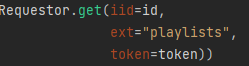

# LB2 Report anhand einer API Generieren

## Die API

Die API aufgrund welcher ein Report generiert werden soll ist eine [Spotify-API](https://api.spotify.com/v1/). Auf dieser können wir Beliebeige Daten aus der Spotify-Datenbank erreichen und im Wöchentlichen Report ausgeben.

## Der Report

Beim starten des Mailservices soll es möglich sein den Report zu Parametrieren. Es sollen mehrere Playlists "abonniert" werden können, für welche der Report uns dann auch immer den wöchentlichen Feed ausgeben soll.

Der Report soll für jede Angewählte Playlist einen einzelnen kleinen Feed beinhalten. Dieser Feed enthält mehrere dinge:

1. Vorschläge, in welche Titel wieder einmal reingehört werden Könnte.
2. Er zeigt änderungen an der Playlist im Vergleich zur letzten Woche an.

### Aussehen

Der Report soll folgendermassen aussehen. Das ganze wird in verschiedene Sektionen, nach Playlist aufgeteilt. Jede Sektion ist mit Playlistvorschau unnd Namen versehen.

Vorgeschlagene Tracks werden mit Titel und Vorschaubild angezeigt. Dazu zeigt der Report uns noch die 10 neusten Tracks. Die Playlist, die Tracks und auch der Ersteller der Playlist sind Clickbar und verlinkt.

Funktioniert aber nur für die ersten 100 songs!

Hier Das [Ergebnis](imgs/PlaylistFeed-r-2022-07-05.pdf)

## Rückblick und Programmbeschrieb

### Programm

Die gesammte Programm ist über ein Json parametrierbar. Da können wir auch unsere Playlists angeben. Für jede angegebene Playlist wird ein einzelner Report versendet.

Die konfiguration für den Mailsender muss per Hand am JSON vorgenommen werden. Es wäre theoretisch auch eine Funktion implementiert, welche das JSON per Programm modifizieren könnte. Diese wird aber nicht genutzt

#### Der Json-Serializer

##### Funktion

Der Serializer hat zwei Funktionen. Das Lesen und das Schreiben aus/in ein Json File. Zusätzlich besteht noch eine Proxyfunktion, welche das Json abspeichert und es nur neu einliest, wenn wir keines mehr gecached haben.

##### Schwierigkeit

Anfangs war der Serializer keine statische Klasse und es war möglich beim erstellen eines solchen den Speicherort des Setting-Files mitzugeben. Da wir aber auch im Logger das Setting-File gebraucht haben kam es so zu einer Rekursion... (Serializer wollte Loggen und Logger brauchte den Serializer)

Nun wird aber im Logger kein Serializer mehr gebraucht. Pfade für settingfile und logfile sind nun hardcoded ):

-> [JSON Infrastruktur](src/utilities/SettingsManager.py)

#### Der Logger

Der Statische logger hat drei primärfunktionen. Er kann einen Error ausgeben, sowie warnings und Infos loggen. Diese Loggt er in ein .log file aber auch in die Konsole.

-> [Logger](src/utilities/Logger.py)

#### Requestor

Der Requestor adressiert die API, welche im appsettingsfile hinterlegt wird. Im appsettingsfile haben wir zwei verschiedene APIS hinterlegt. Einmal die TokenAPI, von wo wir unseren AccessToken holen müssen und einmal die einfache Spotify API

Für den Request erwartet der Requestor eine ItemID also in unserem Fall die Playlist ID eine Link extention, wo wir den Endpoint angeben und den Access Token.

Den Token bekommen wir auch vom Requestor mit der GetToken() funktion.

-> [Requestor](src/utilities/Requestor.py)

#### Messenger

Sendet eine [Mail](src/typedefinitions/Mail.py) an eine in der config eingetragene Adresse.

-> [Messenger](src/utilities/Messenger.py)

#### PushService

Kann ein File mittels Path auf einen ebenfalls in der Config hinterlegten FTP-Server pushen.

-> [PushService](src/utilities/PushService.py)

#### PdfGenerator

Generiert den Report anhand einer [Playlist](src/typedefinitions/Playlist.py). Um diesen zu generieren wollte ich eigentlich erst ein Interface erstellen um dann den Report mit einem Strategy-Patttern zu generieren. Da Python aber nicht Typesafe ist konnte ich diese Idee wieder verwerfen.

Der PdfGenerator an sich hat eine Grundfunktion. Er kann einen Definierten Report generieren. Dafür hat er zwei Private methoden, welche einen Header oder einen Infoblock generieren können.

-> [PdfGenerator](src/utilities/PdfGenerator.py)

### Rückblick

Im Rückblick hätte ich das Programm viel simpler halten können um mir so Zeit und Kopfschmerzen zu sparen.

Der Logger zum Beispiel wäre durch ein einfaces Package getan gewesen und ich hätte nicht das Problem, dass der Log jedes mal Zurückgesetzt wird, wenn wir die Applikation neustarten.

Mit den .env Dateien wäre auch des Json serializer viel einfacher implementiert gewesen. Doch leider wurden diese uns erst vorgestellt, als ich den Serializer schon implementiert hatte.

Alles in allem, funktioniert das Programm aber super und ist auch genug generisch gebaut, dass man es ziemlich schnell auf eine andere Api umbauen könnte. Dazu bräuchte man natürlich einen neuen Generator und eine neue Typdefinition. Logger, Messenger etc. jedoch funktionieren mit jeder API.